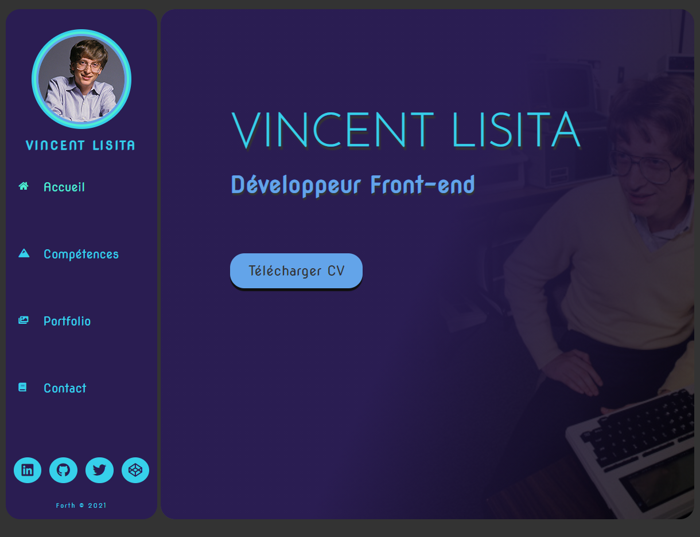
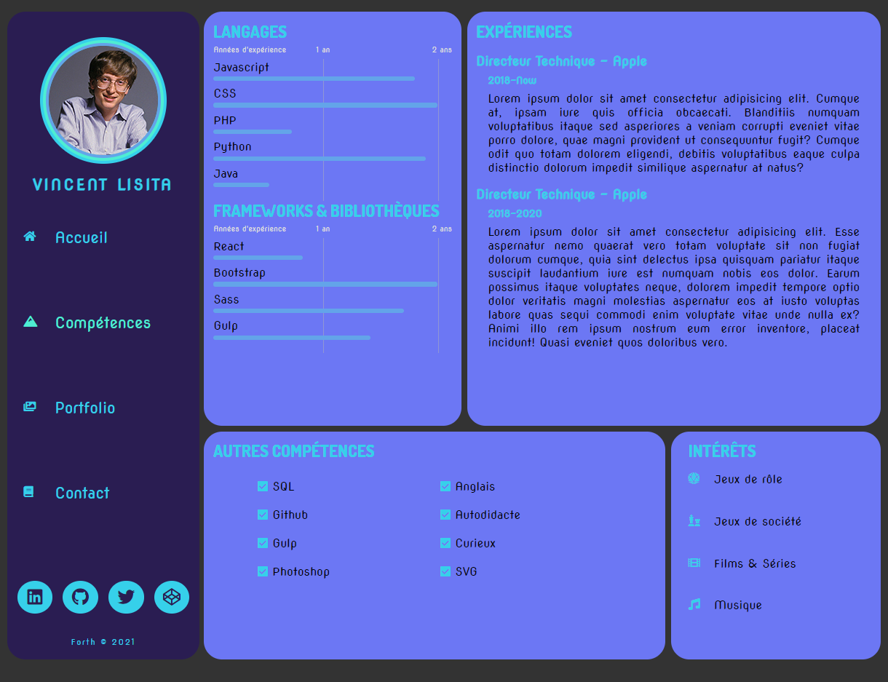
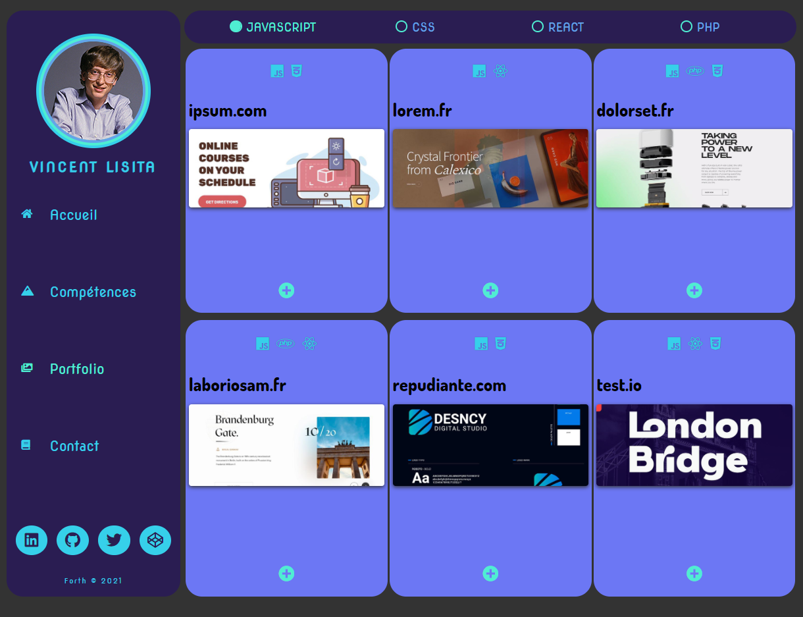
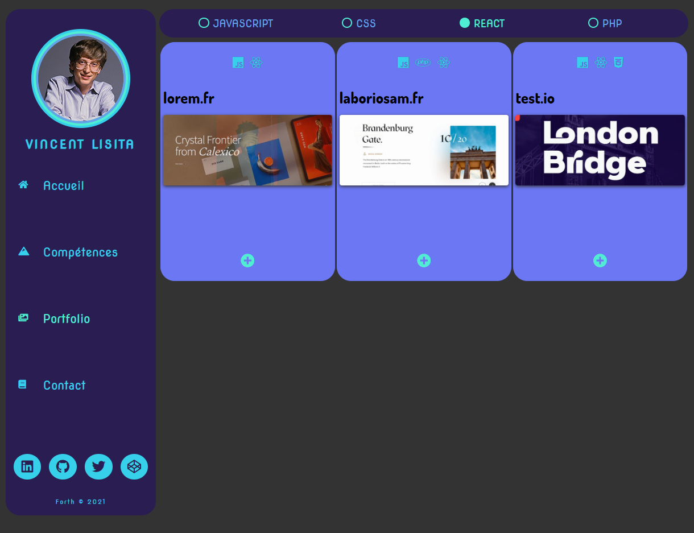
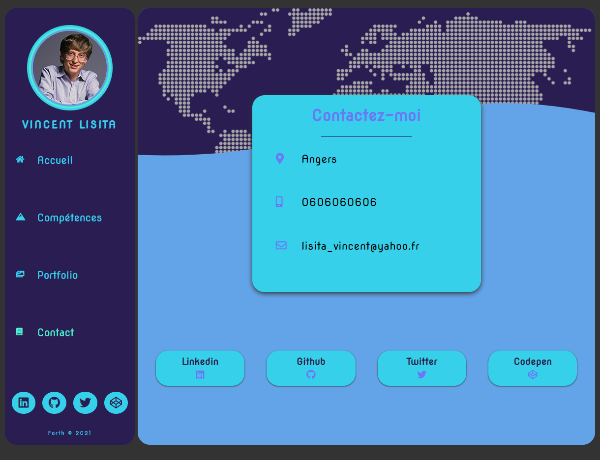
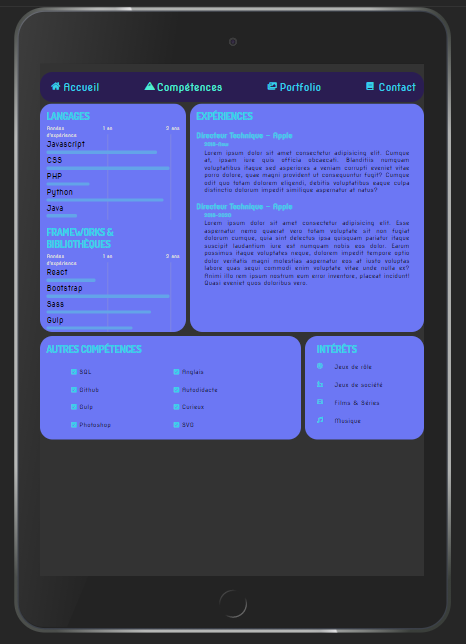
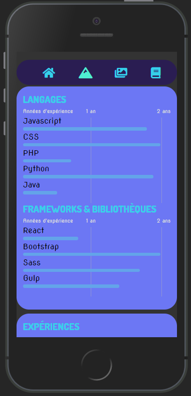
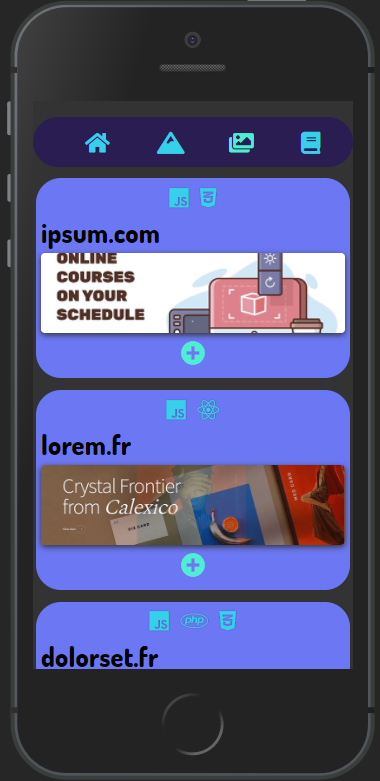

# Introduction

Projet développé à l'aide d'un cours vidéo : [[Projet React] Coder son CV avec la bibliothèque React (débutant)](https://www.youtube.com/watch?v=pS0v5eY7W9k).

# Intérêts de ce projet

Ce second projet a pour but premier de me faire découvrir Réact et de m'améliorer en SASS. Le CV est responsive.

# Problèmes rencontrés

Je n'ai rencontré aucun problème lors du développement de ce projet.

# Améliorations apportées au projet

## Styles

Dans l'ensemble, les styles étaient bons, j'ai juste fait des retouches pour améliorer la responsivité (l'affichage d'un projet par exemple qui sous mobile ne s'adaptait pas à l'écran) et certains affichages, comme les progressbar pour que la longueur corresponde réellement avec la durée saisie dans le code.

De plus, le fait de vouloir rendre le nombre d'éléments pour les languages et les frameworks dynamiques, m'a demandé à rendre la hauteur du block dynamique, ce qui a eu pour effet de complexifier à cause de ma volonté à garder le plus de responsivité possible.

## serviceWorker

Comme le site fonctionne en "1 page", j'ai constaté qu'en cas de déconnexion à internet (ou si le router était coupé), le site continuait à fonctionner. Toutefois, les images du portfolio, entre autres, n'étaient plus chargées. J'ai donc mis en place un serviceWorker afin de mettre en cache les éléments manquant afin que le CV contiue de fonctionner même hors-ligne.

J'ai mis cela en place à l'aide d'une vidéo qui faisait cela sur un site "basique", donc je pense que j'ai du passer à coté de librairie qui m'aurait bien aider à m'être cela en place avec Réact (cf: [Setting up a PWA with service workers and create-react-app](https://blog.logrocket.com/setting-up-a-pwa-with-service-workers-and-create-react-app/))

## Application

Lors de la création d'un projet Réact, un fichier manifest est généré. J'ai donc configuré le fichier afin de rendre possible d'installer le CV comme une application. Autant ce n'est pas utile pour un CV, autant cela pourrait servir pour d'autres sites.

# Ce que m'a apporté ce projet

J'ai fait une belle découverte avec Réact. J'ai vraiment apprécié la façon donc le code est structuré. J'ai pu apprendre la gestion du cache à l'aide du serviceWorker, qui peut s'avérer très utile pour des API qui font appel à des données externes, afin de les garder fonctionnelles.

J'ai aussi pu utiliser le copier/coller dans le presse-papier lors de ce projet. Rarement utile, mais toujours bon de savoir comment le mettre en place.

Et enfin, le système de boutons radio sur le portfolio qui permet de n'afficher que les projets utilisant un certain langage était très intéressant à mettre en place. Ceci pourrait m'être utile dans de multiples projets futurs.

# Améliorations possibles

Une amélioration possible serait de pouvoir afficher plus de 6 projets via un système de pagination. A l'heure actuelle, seul les 6 premiers seront affichés sans aucun message pour nous signaler qu'il y en a plus.

A noter aussi, que la partie Formation n'est pas inclus dans ce CV, nous pourrions donc l'ajouter.

# Screenshots du résultat

### Version pc

### Version iPad

### Version Mobile

